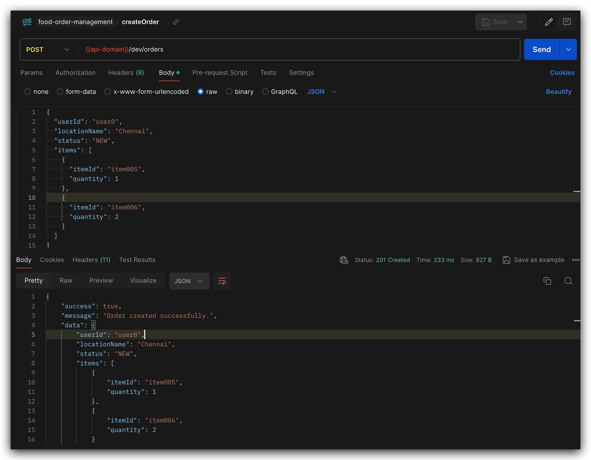
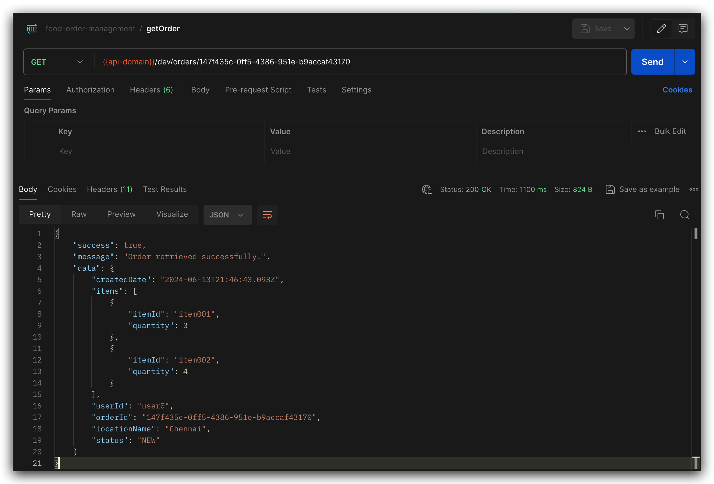
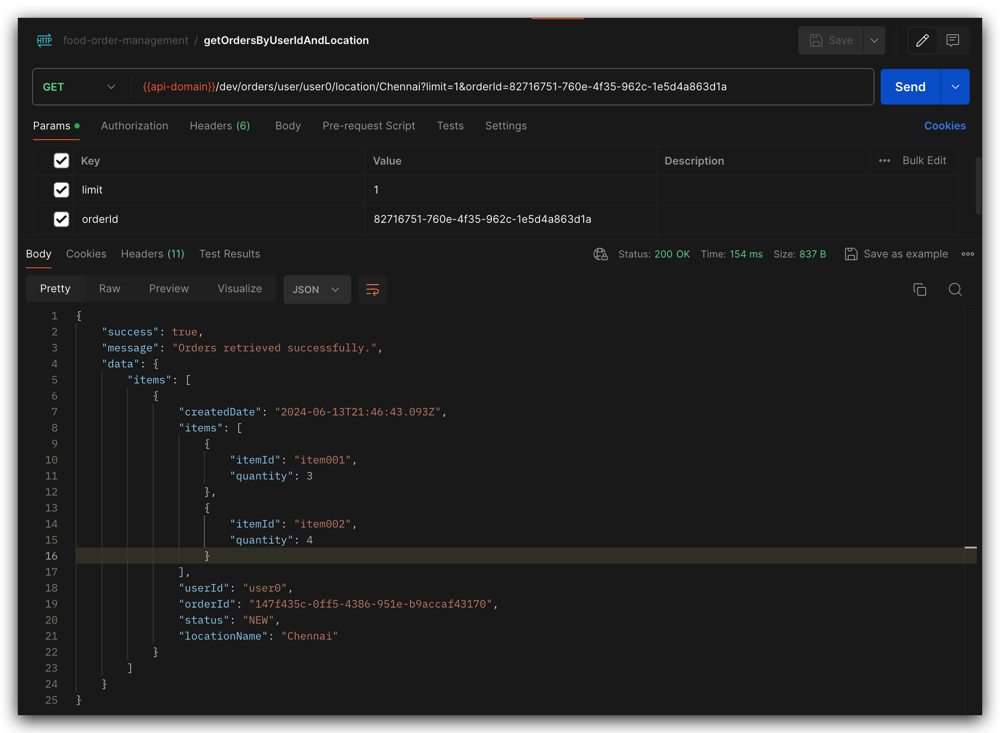
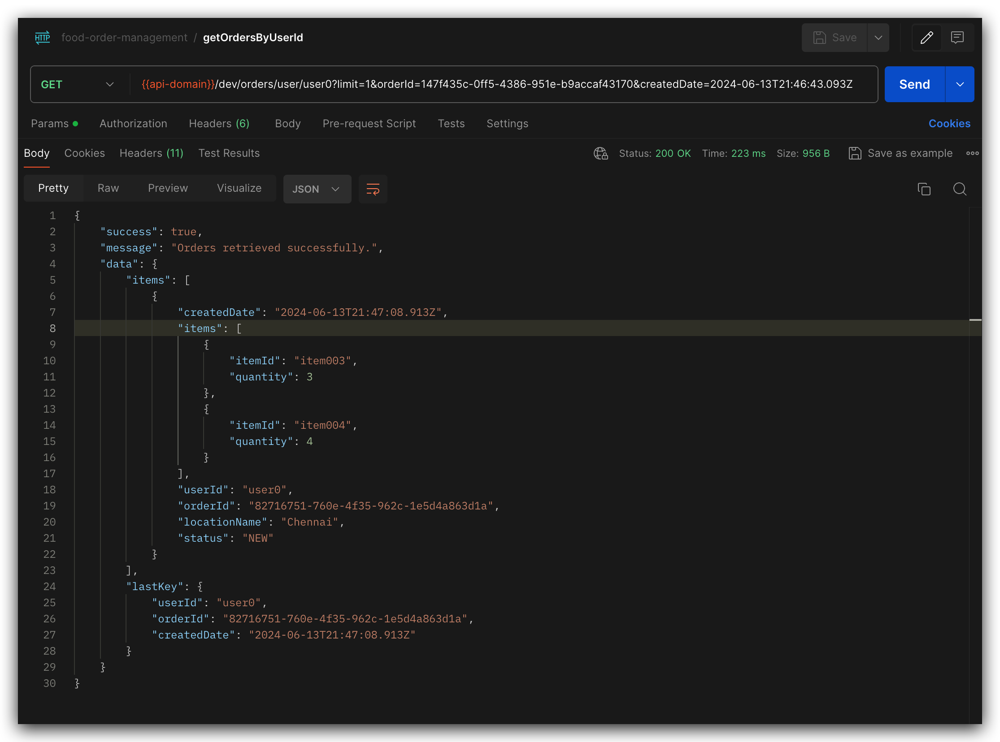
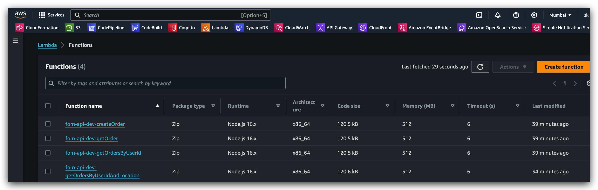
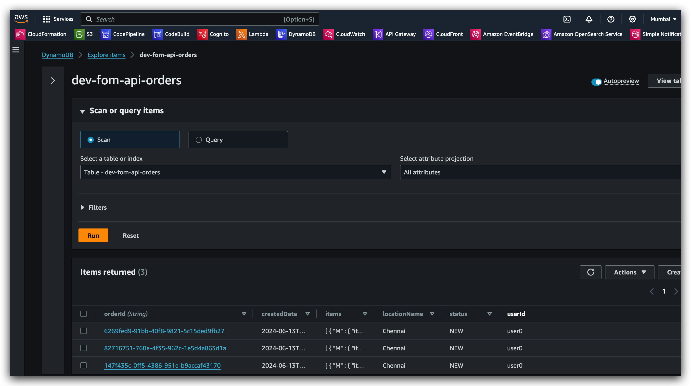
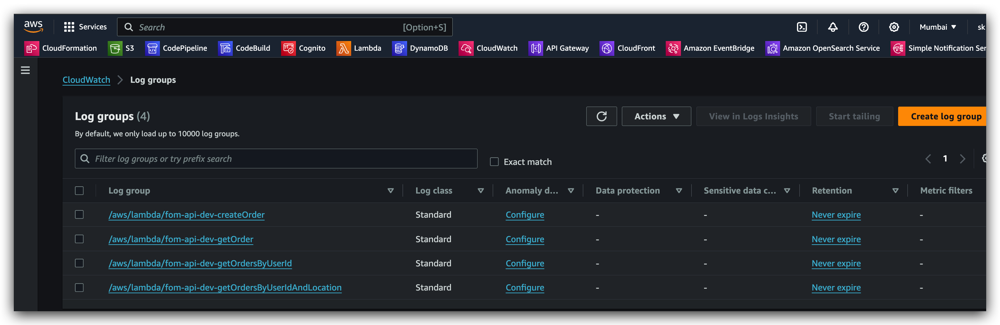

# Food Order Management API Application

This project is a Food Order Management API application built using the Serverless Framework. It includes various APIs for managing food orders, integrated with AWS services.

## Installation Steps

1. **Install Serverless Framework**:

   ```sh
   npm install -g serverless
   ```

2. **Install Project Dependencies**:

   ```sh
   npm install
   ```

3. **Run Locally**:

   ```sh
   serverless offline
   ```

4. **Deploy to AWS**:
   ```sh
   serverless deploy
   ```

## Usage

### Running Locally

To run the application locally, use the `serverless offline` command. This will start the Serverless offline plugin which emulates AWS Lambda and API Gateway on your local machine:

```sh
serverless offline
```

## Project Structure

```
.
├── README.md
├── package-lock.json
├── package.json
├── postman
│   └── food-order-management.postman_collection.json
├── serverless-ext
│   ├── dynamodb.yml
│   └── iam.yml
├── serverless.yml
├── src
│   ├── handlers
│   │   └── orders
│   │       ├── CreateOrderHandler.ts
│   │       ├── GetOrderHandler.ts
│   │       ├── GetOrdersByUserIdAndLocationHandler.ts
│   │       └── GetOrdersByUserIdHandler.ts
│   ├── models
│   │   └── Order.ts
│   ├── repositories
│   │   └── OrderRepository.ts
│   ├── schemas
│   │   └── orderSchema.ts
│   ├── services
│   │   └── OrderService.ts
│   └── utils
│       ├── dynamoDbClient.ts
│       ├── getRequestBody.ts
│       ├── logger.ts
│       └── response.ts
├── tsconfig.json
└── webpack.config.js
```

## APIs

### 1. Create Order

- **Path**: `/orders`
- **Method**: `POST`
- **Description**: Creates a new order.
- **Handler**: `CreateOrderHandler.ts`

### 2. Get Order by ID

- **Path**: `/orders/{orderId}`
- **Method**: `GET`
- **Description**: Retrieves an order by its ID.
- **Handler**: `GetOrderHandler.ts`

### 3. Get Orders by User ID with Pagination

- **Path**: `/orders/user/{userId}`
- **Method**: `GET`
- **Description**: Retrieves orders for a user with pagination.
- **Handler**: `GetOrdersByUserIdHandler.ts`

### 4. Get Orders by User ID and Location with Pagination

- **Path**: `/orders/user/{userId}/locationName/{location}`
- **Method**: `GET`
- **Description**: Retrieves orders for a user by location with pagination.
- **Handler**: `GetOrdersByUserIdAndLocationHandler.ts`

## DynamoDB Table

A DynamoDB table is used to store order information. The table and its indexes are defined in the `serverless.yml` file. The table includes the following attributes and indexes:

### Table Attributes

- `orderId` (Partition Key)
- `userId`
- `locationName`
- `createdDate`

### Global Secondary Indexes

- `userId-index`
  - **Partition Key**: `userId`
  - **Sort Key**: `createdDate`
  - **Projection**: All attributes
- `locationName-index`
  - **Partition Key**: `locationName`
  - **Sort Key**: `createdDate`
  - **Projection**: All attributes
- `userId-locationName-index`
  - **Partition Key**: `userId`
  - **Sort Key**: `locationName`
  - **Projection**: All attributes

The `userId-index` allows for efficient queries by user ID, ordered by the created date of the orders. The `locationName-index` allows for efficient queries by location, ordered by the created date of the orders. The `userId-locationName-index` allows for efficient queries by both user ID and location, providing more specific results.

## Deployment

The API is deployed to AWS using the Serverless Framework. The deployment includes setting up the necessary AWS Lambda functions, API Gateway endpoints, and DynamoDB tables.

### Deploying to AWS

To deploy the application to AWS, use the following command:

```sh
serverless deploy
```

This deployment process will:

- Create the necessary AWS Lambda functions.
- Set up API Gateway endpoints.
- Provision DynamoDB tables and indexes as defined in the `serverless.yml` configuration.

You can verify the deployment by checking the AWS Management Console for the newly created resources. Additionally, the deployed API endpoints will be provided in the output of the `serverless deploy` command.

## Postman Collection

A Postman collection is available in the `postman` folder of the project. This collection includes requests for all implemented APIs, facilitating easier testing and sharing of API endpoints.

### Using the Postman Collection

1. Open Postman.
2. Import the Postman collection file from the `postman` folder: `food-order-management.postman_collection.json`.
3. Use the collection to test the various API endpoints.

The collection includes sample requests with the necessary parameters for each API, making it easy to test the functionality of the application.

## Screenshots

### Postman






### AWS Console




